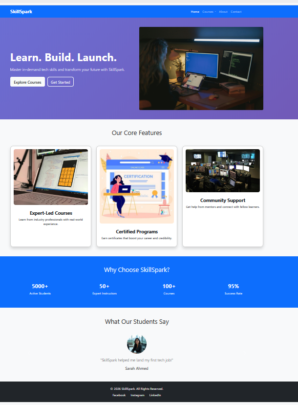
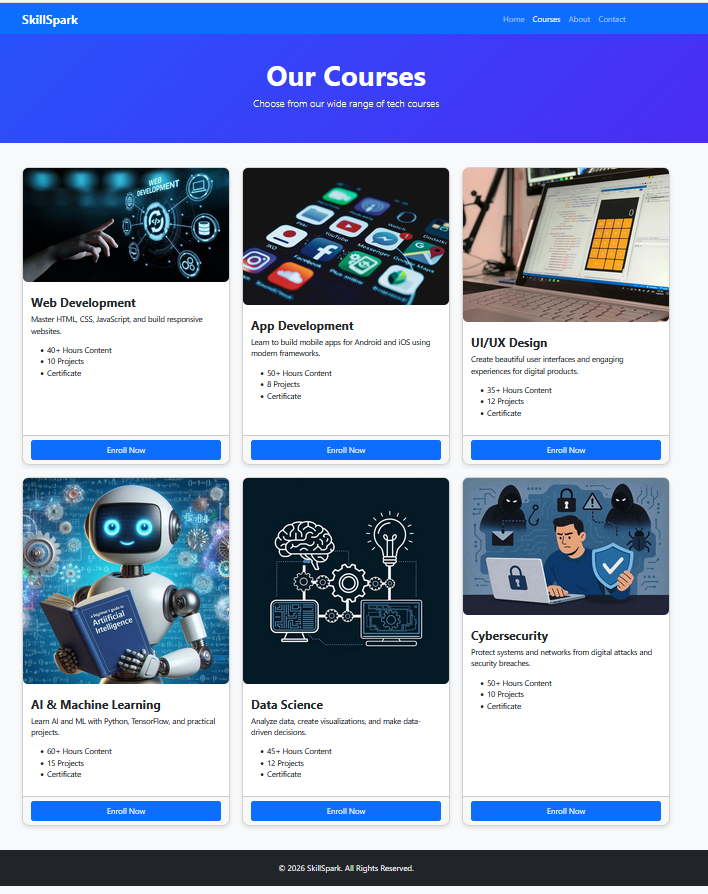
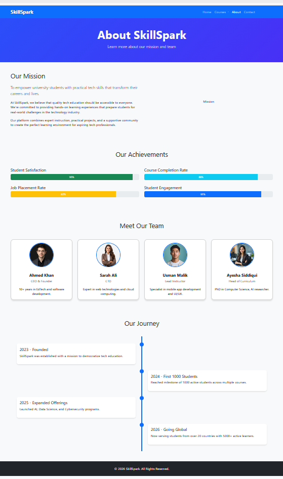
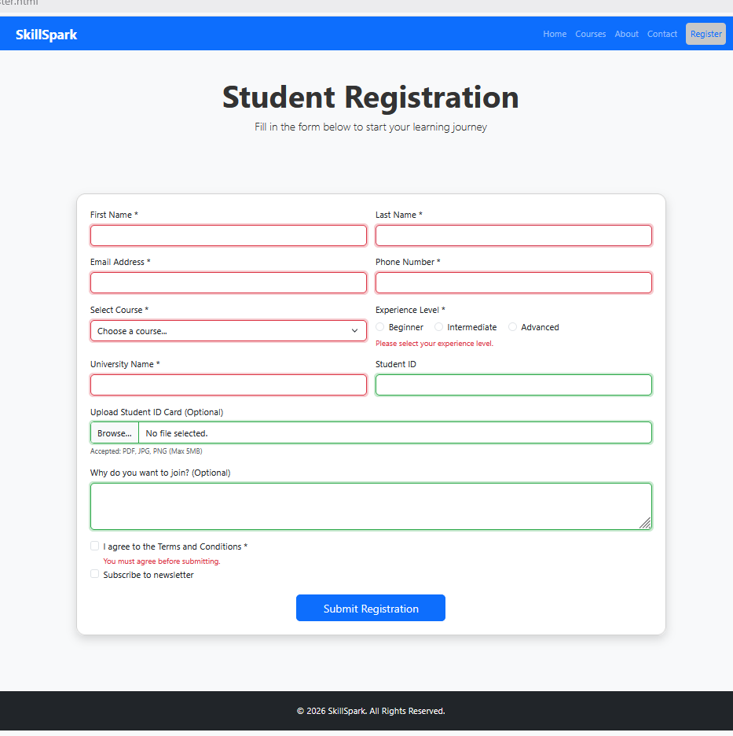
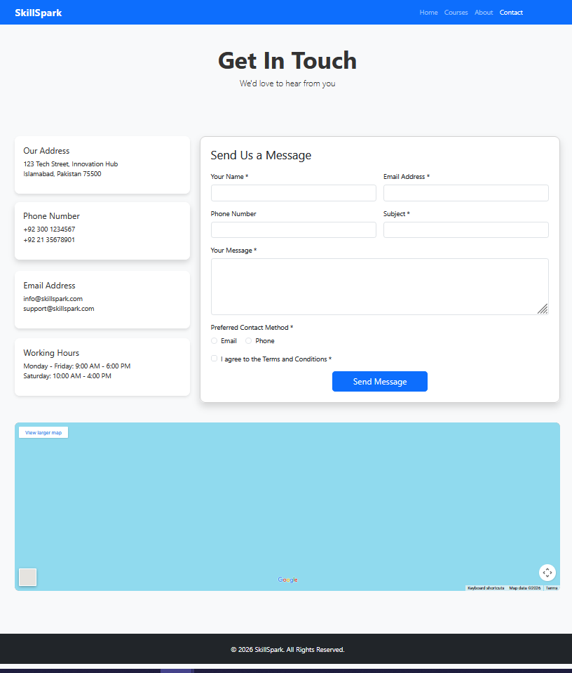

# SkillSpark - Learn. Build. Launch.

## Project Description
SkillSpark is a promotional website for an online learning platform that offers tech courses to university students. The platform provides courses in Web Development, App Development, UI/UX Design, AI & Machine Learning, Data Science, and Cybersecurity.

This project is built using **HTML5, CSS3, and Bootstrap 5** as part of a Web Technologies university assignment. It is **UI-only** with no backend implementation.

## Features

### Homepage (index.html)
- Responsive navigation bar with dropdown menu
- Hero section with gradient background and call-to-action button
- Three feature cards highlighting platform benefits
- "Why Choose Us?" section with statistics
- Testimonials carousel using Bootstrap
- Footer with social media links

### Courses Page (courses.html)
- Display of 6 courses with pricing badges
- Course cards with hover animations
- Modal popups for detailed course information (Bootstrap modal)
- "Enroll Now" buttons linking to registration page
- Fully responsive layout

### About Us Page (about.html)
- Company mission statement
- Team members section using grid layout
- Progress bars showing achievements (student satisfaction, course completion, etc.)
- Timeline showing company milestones
- Responsive design for all screen sizes

### Registration Page (register.html)
- Two-column responsive form layout on desktop
- Form fields: First Name, Last Name, Email, Phone, University, Student ID
- Course selection dropdown
- Radio buttons for experience level
- Checkboxes for terms and newsletter subscription
- File upload for student ID (optional)
- Textarea for additional messages (optional)
- HTML5 validation with **Bootstrap validation classes** (`is-valid` / `is-invalid`)
- Success alert styling for user feedback

### Contact Page (contact.html)
- Contact information cards (address, phone, email, hours)
- Contact form with validation
- Google Maps iframe embedded
- Fully responsive layout

## Technologies Used
- **HTML5**: Semantic markup for structure
- **CSS3**: Custom styling, gradients, hover effects, smooth transitions
- **Bootstrap 5**: Responsive grid system, components, modals, carousels
- **Bootstrap Icons**: Visual elements (optional)
- **No external JavaScript** used beyond Bootstrap's built-in JS

## File Structure
skillspark/
│
├── index.html # Homepage
├── courses.html # Courses page
├── about.html # About us page
├── register.html # Registration form page
├── contact.html # Contact page
│
├── css/
│ └── style.css # Custom CSS styles
│
├── assets/
│ └── images/ # Images used in website
│
└── README.md # Project documentation

## Design Features
- **Custom Color Theme**: Purple gradient (#667eea → #764ba2)
- **Gradient Backgrounds**: Hero sections and key highlights
- **Hover Effects**: Cards lift on hover with smooth transitions
- **Smooth Animations**: Fade-in effects for elements on scroll
- **Responsive Design**: Mobile-first approach using Bootstrap grid
- **Progress Bars**: Visual representation of platform achievements
- **Timeline**: Milestone visualization for About page

### Screenshots
**Home Page**  

**Courses Page**  

**About Us Page**  

**Registration Page**  

**Contact Page**  

## Responsiveness
The website works properly on:
- **Desktop** (1200px and above)
- **Tablet** (768px - 1199px)
- **Mobile** (below 768px)

Bootstrap classes used for responsiveness:
- `col-sm-*` → Small devices
- `col-md-*` → Medium devices
- `col-lg-*` → Large devices

## Browser Compatibility
- Google Chrome (Recommended)
- Mozilla Firefox
- Microsoft Edge
- Safari

## Form Validation
- All forms use **HTML5 validation**
- Bootstrap validation classes (`is-valid` / `is-invalid`) show visual feedback
- Responsive form layout adjusts automatically to screen size

## Credits
**Developer**: Gul E Haram  
**Course**: Web Technologies  
**Semester**: 2nd Semester  
**Submission Date**: March 01, 2026

## License
This project is created for educational purposes as part of a university assignment.

---

© 2026 SkillSpark. All Rights Reserved.